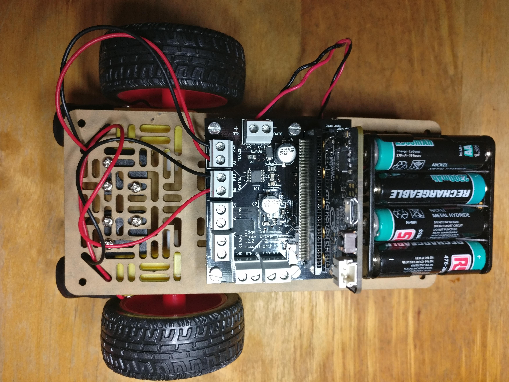

# Anastasia

A wheel-based mobile robot, named after [Dan Dare's spaceship](http://www.dandare.org/dan/anastasia/anastasia.htm) in the Eagle Comic (a classic from my childhood).

Initially Anastasia is being driven by a micro:bit and a separate micro:bit controller,
programmed in micropython and using radio to communicate.

The motors are controlled by a Kitronik motor controller.

Later I plan to replace the micro:bit by an Adafruit Clue and to add Quadrature encoders and a ToF sensor.

I'll control the Clue version via bluetooth.

## Plan

I'm using Freeplane (a free Mind Map editor) for [planning](plan/anastasia-bot-plan.mm). Not everyone uses this software so I have shown the current state of the planning map below.

