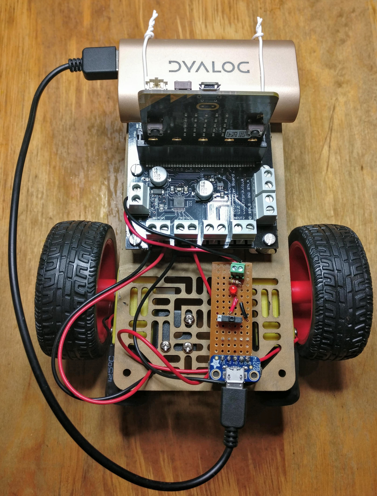
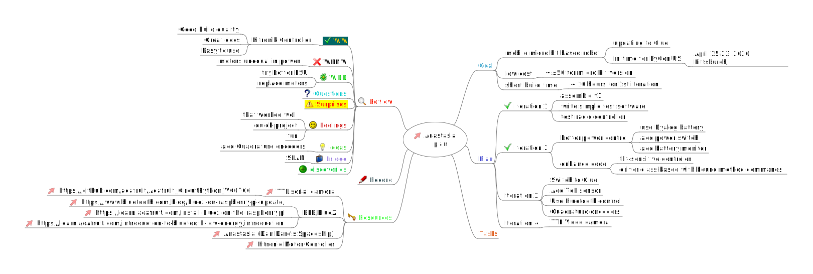

# Anastasia

A wheel-based mobile robot, named after [Dan Dare's spaceship](http://www.dandare.org/dan/anastasia/anastasia.htm) in the Eagle Comic (a classic from my childhood).

Initially Anastasia is being driven by a micro:bit and a separate micro:bit controller, programmed in micropython and using radio to communicate.

The motors are controlled by a Kitronik motor controller.

Later I plan to replace the micro:bit by an Adafruit Clue and to add Quadrature encoders and a ToF sensor.

I'll control the Clue version via bluetooth.

You can read more about the project on my blog:
 
1. [Introduction](https://blog.rareschool.com/2020/03/yet-another-homebrew-robot.html).
1. [Anatasia goes live on GitHub](https://blog.rareschool.com/2020/03/anastasia-is-simple-home-brew-robot-now.html)
1. [Controller Code](https://blog.rareschool.com/2020/03/controlling-anastasia-from-second.html)
1. [Code for Anastasia](https://blog.rareschool.com/2020/03/driving-anastasias-kitronik-motor.html)

## Building your own Anastasia

I built Anastasia from parts I had to hand. They are all readily available, apart from the Dyalog Phone Charger Battery for which there are plenty of alternatives.)

Version one of Anastasia needed no soldering. If you don't want to solder your version, that will restrict your choice of motor. Some have leads pre-soldered, some do not.

Version 2 (the current version) has a little strip board power controller, with a USB socket, a switch, an LED, a resistor and a terminal block for output. That's entirely optional, and I discuss alternatives in the build instructions. If you don't want to build it, the rest of Anastasia needs no soldering.

I'm currently working on adding an inexpensive LIDAR distance sensor to Anastasia. There are some technical challenges, but if I can overcome them I will add details to this repository. That will be a rather more advanced project, and it will need some soldering.

Here's the BOM (Bill of Materials), along with the sources I used.

When I started the project Anastasia was connected to a battery holder and powered by 4 AA rechargeable batteries. 

Later I replaced the battery holder by a little strip board circuit with an on-off switch, a power LED, and a USB power socket.

I've listed these as alternatives in the BOM and in the assembly instructions which I will add later today.

### Bill of Materials

#### Anastasia and Controller

**Notes**

1. *Generic* is my shorthand for *available from lots of places - any will do!* 
1. Alternative motors are widely available, but you'll need to check a few things.
    1. Make sure the motors are described sa *TT motors*.
    1. Make sure the motors can run off 3-6 volts. Some appear to be 3v only; these might burn out.
    1. Make sure the motors will fit the Motor brackets. Some have a large raised pillar around their shaft.
    1. Make sure the size and shape of the motor shaft matches the wheels you get.
    1. If you don't want to do any soldering, make sure the motors have wires attached.
    

|Component|Qty|Where I got it/them|Comment|
|-----------------------------------------|---|--------------|-------|
|micro:bit|2|[Kitronik](https://www.kitronik.co.uk/5613-bbc-microbit-board-only.html)|One for Anastasia, one for the controller|
|Kitronik micro:bit Motor Controller|1|[Kitronik](https://www.kitronik.co.uk/5620-motor-driver-board-for-the-bbc-microbit-v2.html)|v 2.0|
|battery holder with switch|1|[Kitronik](https://www.kitronik.co.uk/2268-2x-aa-battery-box-with-switch-and-connector.html)
|Pololu board|1|[Proto-PIC](https://www.proto-pic.co.uk/product/pololu-1532-rp5rover-5-expansion-plate-rrc07a-narrow-solid-blue/)|
|TT motor|2|[The Pi Hut](https://thepihut.com/products/adafruit-dc-gearbox-motor-tt-motor-200rpm-3-to-6vdc-ada3777)|Slower than mine, but more powerful|
|TT wheel|2|[The Pi Hut](https://thepihut.com/products/adafruit-orange-and-clear-tt-motor-wheel-for-tt-dc-gearbox-motor-ada3766)|Fits the motor above|
|Adafruit caster 1.3"|1|[The Pi Hut](https://thepihut.com/products/adafruit-supporting-swivel-caster-wheel-1-3-diameter)|
|Adafruit motor brackets|2|[The Pi Hut](https://thepihut.com/products/adafruit-motor-mount-for-tt-gearbox-dc-motors-l-bracket-type-ada3768)||
|usb lead for programming|1|Generic|Make sure it's a data lead, not just a power lead!|
|Resistor 470R 1/8W|1|Generic|1/4 W would also be OK. 5% tolerance is fine.|
|M3 spacers|4|Generic|Mine were 12mm, bt any length will do.|
|M3 bolts|4|Generic|A a little longer than the spacers.
|M3 nuts|4|Generic||
|AA battery|2|Generic|Rechargeable batteries are greener.|

and **one of the alternatives below**:

#### If you use a simple battery holder for Anastasia

|Component|Qty|Where I got it/them|Comment|
|-----------------------------------------|---|--------------|-------|
|battery holder|1|Generic|4 cells. Make sure it has leads attached!|
|AA cells|4|Generic|Rechargeable batteries are greener.|

#### If you use a Phone charger and stripboard with switch

|Component|Qty|Where I got it/them|Comment|
|-----------------------------------------|---|--------------|-------|
|switch|1|[BitsBox](https://www.bitsbox.co.uk/index.php?main_page=product_info&cPath=116_120_124_125&products_id=2364)||
|Stripboard (9x27)|1|[BitsBox](https://www.bitsbox.co.uk/index.php?main_page=product_info&cPath=238_244&products_id=1855)|If cut down, >= 6x20|
|Adafruit USB socket|1|[Pimoroni]()||
|Mobile charger|1|Generic|Use any charger that can provide 5V and 1A or more.|
|LED 3mm|1|Generic||
|short USB lead to connect battery + power unit|1|Generic|

#### Assembly Instructions

**Coming later today!**

## Project Plan

I'm using Freeplane (a free Mind Map editor) for [planning](plan/anastasia-bot-plan.mm). Not everyone uses this software so I have shown the current state of the planning map below.

